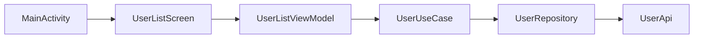

# ComposeIt

ComposeIt is a sample android application made with Jetpack Compose

This app contains a single page loading several random users from an API

UI us built using Jetpack Compose and the data is fetched using Retrofit

States are managed using Android ViewModel

Dependencies are injected using Koin

App architecture is based on Clean Architecture

## What is Jetpack Compose?

Jetpack Compose is a modern toolkit for building native Android UI. It simplifies and accelerates UI development on Android with less code, powerful tools, and intuitive Kotlin APIs.

More information [here](https://developer.android.com/jetpack/compose)

## Used dependencies

- [Jetpack Compose](https://developer.android.com/jetpack/compose)
- [Retrofit](https://square.github.io/retrofit/)
- [Koin](https://insert-koin.io/)
- [Coil](https://coil-kt.github.io/coil/)

## Used API

- [Random User](https://randomuser.me/)